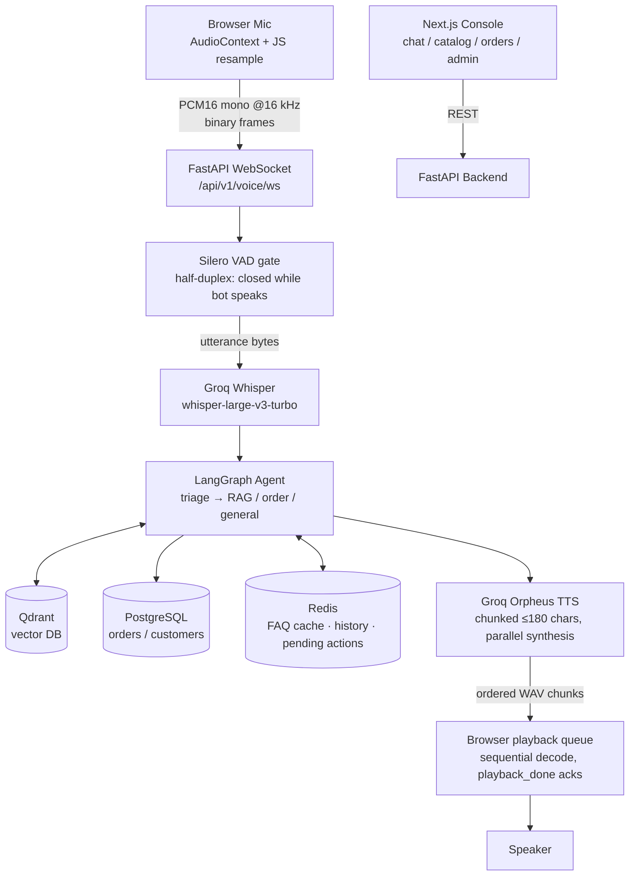

# OmniVoice AI (VoiceSell)

**Production-grade, voice-enabled commerce agent** — a pure WebSocket voice pipeline (browser microphone → server-side VAD → Groq Whisper → LangGraph agent → streamed TTS back to the browser), RAG-grounded product recommendations, per-user order isolation with Supabase auth, and an automated end-to-end voice tester that places real orders before you ever open your mic.

[](./backend)
[](./frontend)
[](./render.yaml)

---

## The Problem

1. **High support overhead & latency** — text chatbots are slow and can't handle nuanced product inquiries in real time.
2. **Hallucinated product knowledge** — LLMs invent specs, pricing, and stock availability when not grounded in a verified index.
3. **Risky order operations** — letting an agent place/modify/cancel orders is dangerous without explicit confirmation gates.
4. **Orders leaking across users** — demo builds often share one hardcoded "demo customer", so everyone sees everyone's orders.
5. **Fragile voice stacks** — heavyweight WebRTC/media-server dependencies are hard to deploy on free tiers and hard to debug when they fail silently.

## How It's Solved

- **Pure-WebSocket voice pipeline** — no Daily room, no media server. The browser streams raw 16 kHz PCM over one WebSocket; the backend runs Silero VAD, Groq `whisper-large-v3-turbo` STT, the agent, and chunked Orpheus TTS in-process.
- **Half-duplex turn-taking by construction** — while the bot is speaking, mic audio is gated off server-side *and* client-side, so echo can never be transcribed and barge-in artifacts can't corrupt turns.
- **RAG-grounded catalog** — products vectorized into Qdrant (Gemini embeddings); every catalog answer is grounded and cited.
- **LangGraph agent with a confirmation gate** — quotes first, asks "Shall I place this order?", executes only after an audible yes/no; survives Redis loss with a history-fallback gate.
- **Per-user order isolation** — every order is scoped to a real identity: a Supabase email/password account, or a private per-browser guest ID (developer mode).
- **Self-testing before ship** — `tools/e2e_voice_test.py` simulates the entire browser (synthesizes speech, streams it as mic audio, listens to replies) and asserts greeting → transcript → quote → order placement against any deployment, production included.

---

## Voice Pipeline (what actually runs)



Protocol details:

| Direction | Payload | Meaning |
| --- | --- | --- |
| Client → Server | binary | raw PCM16 mono, 16 kHz, ~32 ms frames |
| Client → Server | JSON `{"type":"playback_done"}` | all queued reply chunks finished playing |
| Server → Client | JSON `ready` / `transcript` / `agent_caption` / `speaking_start` / `error` | session lifecycle + captions |
| Server → Client | binary | one complete WAV (Orpheus 24 kHz mono) per text chunk, delivered strictly in order |

Turn-taking constants live at the top of [`backend/app/voice/ws_session.py`](./backend/app/voice/ws_session.py): start/end confidence thresholds, 1.5 s silence-to-end, 20 s max utterance, pre-roll buffer, LLM timeout, watchdog.

---

## Authentication & Order Isolation

Every order the agent places is owned by an identity resolved in the frontend and threaded through chat REST, the voice WebSocket, and into the LangGraph state (`customer_id`):

| Mode | Identity | Where it comes from |
| --- | --- | --- |
| **Signed in** | Supabase auth user UUID | email/password login screen (`components/auth.tsx`) |
| **Guest (developer mode)** | random UUID persisted in `localStorage` | created per browser; a fresh incognito window gets its own |

This fixes the classic demo bug where all visitors shared one hardcoded customer row and saw each other's orders — two guest windows now have provably disjoint histories (see `tools/test_isolation.py`).

### Enabling email/password login (Supabase setup)

The app degrades gracefully: with no Supabase public env vars set, it runs **guest-only** (no login screen). To turn on real accounts:

1. Open your project at [supabase.com/dashboard](https://supabase.com/dashboard).
2. **Authentication → Providers → Email**: make sure Email is **enabled**.
3. **Authentication → Sign In / Up**: for a frictionless demo, turn **off** "Confirm email". If you leave it on, signups will be told to confirm via inbox before signing in (the UI handles this).
4. **Project Settings → API**: copy the **Project URL** and the **anon public** key (`sb_publishable_…` or the legacy JWT). ⚠️ Never use the service/secret key (`sb_secret_…`) in the browser — it bypasses everything.
5. Set them wherever the frontend runs:
   - local: `frontend/.env.local` → `NEXT_PUBLIC_SUPABASE_URL`, `NEXT_PUBLIC_SUPABASE_ANON_KEY`
   - Render: frontend service → Environment → the same two keys (declared as `sync: false` in `render.yaml`)
6. Redeploy/restart the frontend. The login gate appears; "Continue as Guest" stays available below it.

No SQL migrations are needed for auth itself — the backend owns its tables via SQLAlchemy and get-or-creates a matching `customers` row for any identity that places an order.

> **Scope note:** the backend trusts the `customer_id` supplied by the client (fine for a demo; there is no RLS/JWT verification server-side). Hardening would mean verifying the Supabase JWT on each request — noted as future work.

---

## Repository Structure

```
├── backend/
│   └── app/
│       ├── api/                # routes (incl. voice_ws.py — the WS endpoint)
│       ├── core/               # config & logging
│       ├── db/                 # models & session lifecycle
│       ├── schemas/            # Pydantic schemas
│       ├── services/           # RAG / agent graph / order service / cache
│       └── voice/              # ws_session.py — VAD→STT→agent→TTS pipeline
├── frontend/
│   ├── app/                    # routes (landing, chat, catalog, orders, admin)
│   ├── components/auth.tsx     # Supabase login gate + guest mode
│   └── lib/                    # api client, supabase client
├── tools/
│   ├── e2e_voice_test.py       # browser-simulating voice E2E (places real orders)
│   ├── test_isolation.py       # proves two guests never see each other's orders
│   └── purge_faq_cache.py      # ops helper: drop poisoned FAQ cache entries
└── render.yaml                 # Render Blueprint (backend + frontend + Postgres + Redis)
```

(The retired Daily/Pipecat transport files remain under `backend/app/voice/` but are unused.)

---

## Local Development

**Prerequisites:** Docker & Docker Compose, Python 3.11+, Node.js 18+.

```bash
# 1. Infra
docker compose up -d postgres qdrant

# 2. Backend
cd backend
cp .env.example .env          # fill in your keys
uv run python -m scripts.ingest_olist
uv run uvicorn app.main:app --reload --port 8000

# 3. Frontend (new terminal)
cd frontend
cp .env.example .env.local    # optional: NEXT_PUBLIC_SUPABASE_* for login
npm install
npm run dev
```

Open http://localhost:3000.

### Tests

```bash
cd backend
uv run pytest
uv run pyright app/
uv run ruff check app/ tests/

# End-to-end voice test against ANY running backend (default localhost:8000):
python tools/e2e_voice_test.py $GROQ_API_KEY
E2E_WS_URL=wss://voicesell-backend.onrender.com/api/v1/voice/ws?session_id=e2e \
  python tools/e2e_voice_test.py $GROQ_API_KEY     # ...against production

# Order-isolation proof (two guests, one shared backend):
python tools/test_isolation.py
```

The voice harness receives the greeting WAV, synthesizes spoken questions with Groq TTS, resamples them to 16 kHz PCM, streams them exactly like the browser does, and asserts: greeting plays → utterance transcribed correctly → order quoted → confirmation places a **real order**. Run it after every backend change; if it passes in production, the mic in your browser is not the variable anymore.

---

## Deploying to Render

The repo ships a [`render.yaml`](./render.yaml) Blueprint provisioning four linked resources: Postgres, Redis (Key Value), the backend (Docker web service), and the frontend (Node web service).

1. Push to GitHub (branch `master`) → Render **New + Blueprint** → select repo → Apply.
2. Fill the secrets marked `sync: false` in the dashboard:
   - Backend: `QDRANT_URL`, `QDRANT_API_KEY`, `SUPABASE_URL`, `SUPABASE_KEY`, `GROQ_API_KEY`, `GEMINI_API_KEY`, `LANGSMITH_API_KEY` (optional), `OTEL_EXPORTER_ENDPOINT` (optional).
   - Frontend: `NEXT_PUBLIC_SUPABASE_URL`, `NEXT_PUBLIC_SUPABASE_ANON_KEY` (optional — omit for guest-only mode). `NEXT_PUBLIC_BACKEND_URL` is pre-wired.
3. Redeploy after saving env vars.

> **Free-plan note:** embeddings call the Gemini API instead of shipping a local sentence-transformer, keeping the backend inside Render's free-tier memory budget. Expect multi-second agent latency on order turns (two chained LLM calls) — the pipeline tolerates it with a 60 s timeout and a spoken fallback phrase.

### Auto-seeding

On first boot the backend checks whether `products` is empty and, if so, ingests the Olist catalog into Postgres and upserts embeddings into Qdrant inline, once, before serving traffic. Disable with `AUTO_SEED=false`. If Qdrant isn't configured during seed, Postgres still fills (catalog page works) and only chat/voice search needs the keys fixed later.

### Debugging a deployed voice bot without log access

- `GET /health` — db/qdrant connectivity.
- `GET /api/v1/voice/events` — in-memory ring of recent session events (`vad_probe conf=… kb=…`, `stt`, `tts_chunk`, `tts_fail`, `turn_error`). Read it immediately after a test call; it's small and evicts fast.

---

## Known Limitations

- Bare catalog phrasings like *"What products do you have?"* can under-retrieve (keyword extraction finds nothing specific); *"Show me some products"* or category-scoped questions work well.
- No server-side JWT verification yet — identity is trusted from the client.
- Half-duplex by design: you can't interrupt the bot mid-sentence.
- Free-tier LLM latency means a few seconds of thinking time on order turns.
