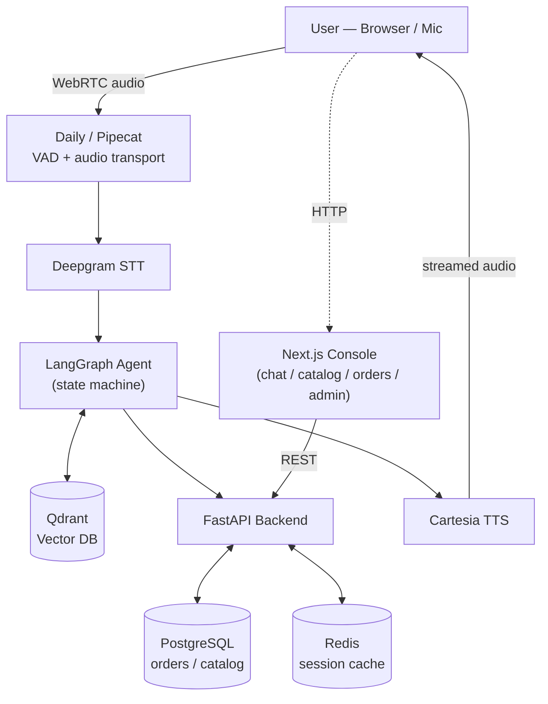

# 🎙️ Calliope AI (VoiceSell)

**Production-grade, voice-enabled commerce agent** — real-time WebRTC voice pipeline + RAG-grounded product recommendations, built on Pipecat, LangGraph, Qdrant, and FastAPI.

[](./backend)
[](./frontend)
[](./render.yaml)

---

## The Problem

1. **High support overhead & latency** — text chatbots are slow and can't handle nuanced product inquiries in real time.
2. **Hallucinated product knowledge** — LLMs invent specs, pricing, and stock availability when not grounded in a verified index.
3. **Risky order operations** — letting an agent place/modify/cancel orders is dangerous without explicit confirmation gates.
4. **Disjointed voice UX** — most voice-bot builds suffer multi-second latency and no barge-in support.

## How It's Solved

- **Sub-500ms voice pipeline** — WebRTC audio via Daily, VAD, Deepgram STT, Cartesia streaming TTS, barge-in support.
- **RAG-grounded catalog** — the Olist Brazilian e-commerce dataset (74+ categories) is vectorized into Qdrant (768-dim embeddings); every answer is grounded and cited.
- **LangGraph agent** — stateful multi-turn sales conversations with an explicit confirmation gate before any order mutation.
- **Upsell engine** — one relevant cross-sell suggestion per confirmed order, based on association mining + vector similarity.

---

## Architecture



Static diagram assets (from earlier design passes) are also kept in the repo:

- [`Images/VoiceArchitecture.png`](./Images/VoiceArchitecture.png)
- [`Images/ChatArchitecture.png`](./Images/ChatArchitecture.png)

---

## Tech Stack

| Layer      | Technology                                                                             |
| ---------- | -------------------------------------------------------------------------------------- |
| Backend    | Python 3.11, FastAPI, SQLAlchemy, Pydantic v2,`uv`                                     |
| Frontend   | Next.js 16 (App Router), React 19, Tailwind, Motion, Phosphor Icons                    |
| Databases  | PostgreSQL (Supabase-compatible schema), Qdrant vector DB, Redis                       |
| AI / Voice | LangGraph, LiteLLM (multi-provider failover), Deepgram STT, Cartesia TTS, Daily WebRTC |
| Quality    | Ruff, Pyright (strict), Pytest, GitHub Actions CI                                      |

---

## Repository Structure

```
├── backend/                   # FastAPI application
│   ├── app/
│   │   ├── api/                # routes
│   │   ├── core/                # config & logging
│   │   ├── db/                  # models & session lifecycle
│   │   ├── schemas/              # Pydantic schemas
│   │   ├── services/             # Qdrant / RAG / LLM / agent services
│   │   └── voice/                 # Pipecat + Daily voice pipeline
│   ├── scripts/                 # data ingestion & eval scripts
│   ├── tests/                   # pytest suite
│   ├── Dockerfile               # multi-stage production image
│   └── .env.example
├── frontend/                  # Next.js 16 UI
│   ├── app/                     # routes (landing, chat, catalog, orders, admin)
│   ├── lib/                     # API client
│   └── .env.example
├── Images/                    # architecture diagrams
├── docs/                      # deployment & design notes
└── render.yaml                # Render Blueprint (backend + frontend + Postgres + Redis)
```

---

## Local Development

**Prerequisites:** Docker & Docker Compose, Python 3.11+ with `uv`, Node.js 18+.

```bash
# 1. Infra
docker compose up -d postgres qdrant

# 2. Backend
cd backend
cp .env.example .env        # fill in your keys
uv run python -m scripts.ingest_olist
uv run uvicorn app.main:app --reload --port 8000

# 3. Frontend (new terminal)
cd frontend
cp .env.example .env.local
npm install
npm run dev
```

Open http://localhost:3000.

### Tests

```bash
cd backend
uv run pytest
uv run pyright app/
uv run ruff check app/ tests/
```

---

## ☁️ Deploying to Render

This repo ships a [`render.yaml`](./render.yaml) Blueprint that provisions **four** linked resources in one shot: Postgres, Redis (Key Value), the backend (Docker web service), and the frontend (Node web service).

1. Push this repo to GitHub (branch: `master`).
2. In the Render dashboard: **New → Blueprint** → select this repo → Render reads `render.yaml` and shows the resource plan.
3. Click **Apply**. Render creates all four services and auto-wires `DATABASE_URL` / `REDIS_URL` into the backend.
4. Once created, open the backend service → **Environment** and fill in the secrets marked `sync: false` in `render.yaml`:
   `QDRANT_URL`, `QDRANT_API_KEY`, `SUPABASE_URL`, `SUPABASE_KEY`, `GROQ_API_KEY`, `OPENAI_API_KEY`, `OPENAI_BASE_URL`, `OPENAI_MODEL_NAME`, `GEMINI_API_KEY`, `DAILY_API_KEY`, `DEEPGRAM_API_KEY`, `CARTESIA_API_KEY`, `LANGSMITH_API_KEY`, `OTEL_EXPORTER_ENDPOINT`.
5. Redeploy the backend after saving env vars.

> **Free-plan warning:** the backend pulls `torch`, `sentence-transformers`, and `transformers` (multi-GB, memory-heavy). Render's free web service tier (512MB RAM) is very likely to OOM at boot or hit build timeouts. If it fails, move the backend to at least the **Starter** plan.
